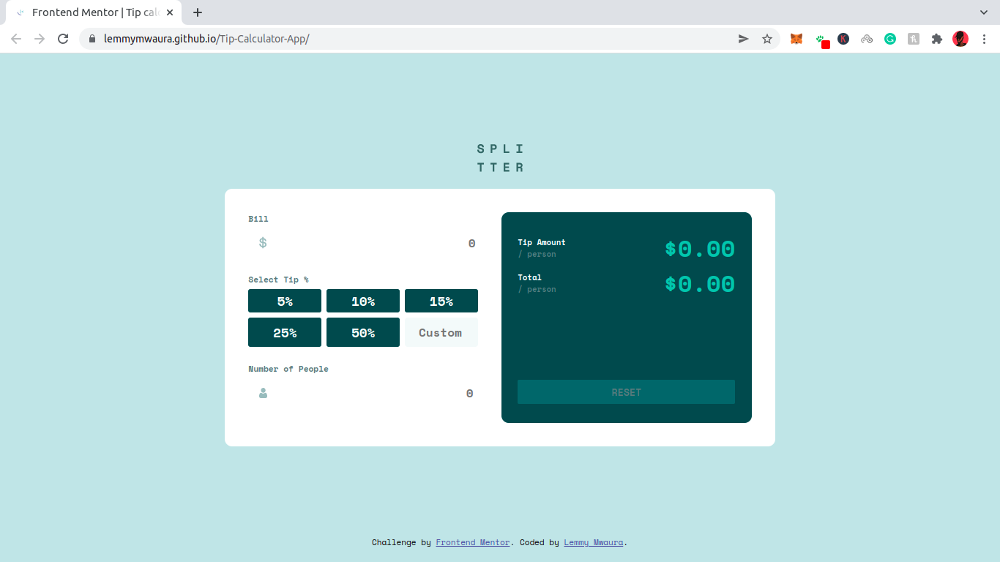

# TipCalculator App
TicTacToe Game. Built with Javascript & SCSS

## Table of contents
  - [Screenshot](#screenshot)
  - [Project Description](#Project-description) 
  - [Links](#links)
  - [Built with](#built-with)
  - [Contact Information](#contact-information)
  - [License & Copywright Information](#License-and-Copywright-Information)
  - [Author](#author)
---
___

### Screenshot

___
---
### Project Description

Tip Calculator App  
You choose your bill amount, The number of people your splitting the bill with then select a percentage of the total bill you want to tip. 
The app will then calcuate the total amount per person that will be paid(Tip per person + Share of the total amount)

---
___
### Links

- Live Site URL: [Tip Calculator App](https://lemmymwaura.github.io/Tip-Calculator-App/)

---
___
### Built with / Technologies Used

- Semantic HTML5 markup
- SCSS which compiles to CSS
- The CSS custom properties
  - Flexbox
  - Grid
  - Media Queries (Mobile responsive)
- Javascript(ES6+)

---
___
### Contact Information

| Name   | Email               |
|--------|---------------------|
| Email  | lemmymwaura@gmail.com |
| Twitter| lemmyMwaura |
| CodePen | [lemmymwaura](https://codepen.io/lemmymwaura) |
| Codewars | [lemmymwaura](https://www.codewars.com/users/LemmyMwaura) |

---
___
### License and Copywright Information
(c) Stephen Lemmy Mwaura, Software Engineer.

Licensed under the [MIT License](LICENSE)

---
___
## Author 
Hi there, I'm Lemmy and i love to code. Connect With me:

- 💻 Project Website - [Tip Calculator App](https://lemmymwaura.github.io/Tip-Calculator-App/)
- 🎱 Github - [@lemmyMwaura](https://github.com/LemmyMwaura)

---
___
